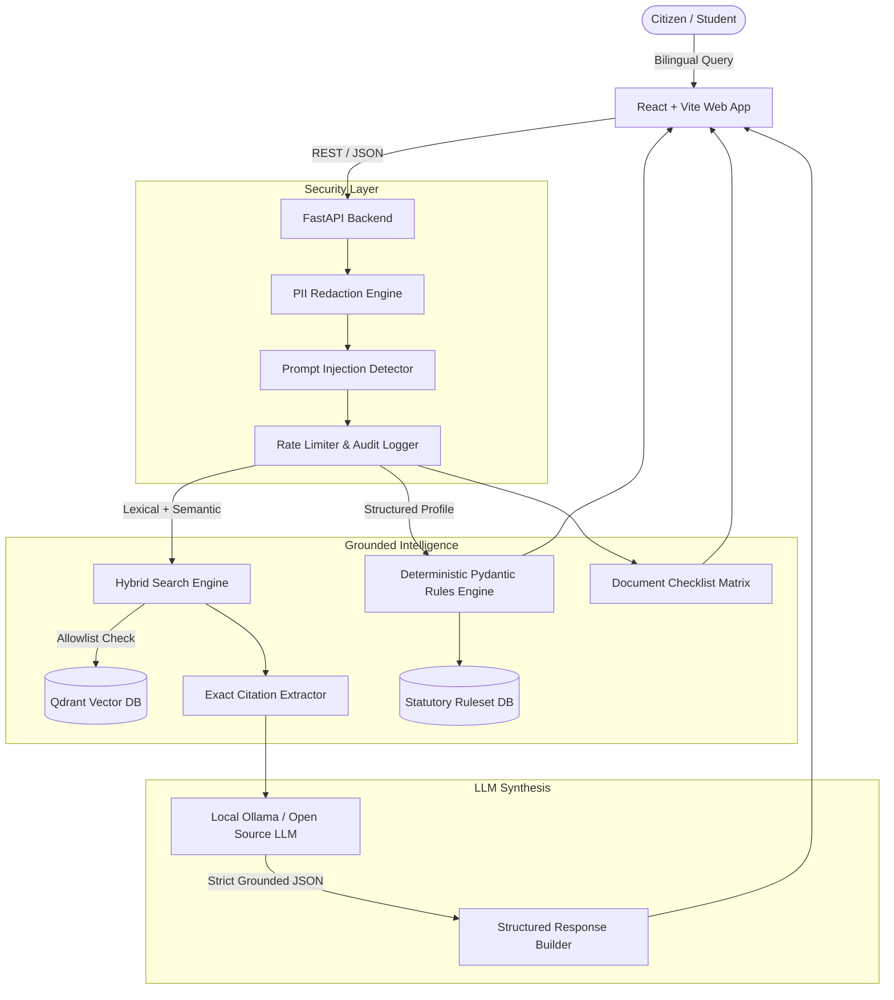

# CivicProof AI - System Architecture

## 1. Architectural Philosophy

CivicProof AI is designed around a single core mandate: **Civic Trust through Verifiable Evidence**. Public-service AI systems cannot afford probabilistic hallucinations regarding income limits, deadlines, reservation categories, or application fees.

---

## 2. Core Pillars & Design Separation

### Pillar 1: Deterministic Rules vs. LLM Prose
- **Deterministic Rules Engine (`apps/api/app/eligibility/engine.py`):**
  Evaluates strict criteria (income `<= 4,50,000`, minimum marks `>= 80%`, government school enrollment) using pure, deterministic Python/Pydantic logic. The LLM is never permitted to determine or guess eligibility.
- **LLM Role:**
  The LLM is restricted to formatting, translating, and summarizing evidence extracted from verified chunks.

### Pillar 2: Strict Citation Anchoring
- Every factual answer generated by the assistant is tethered to a verified source identifier, section clause, page number, and SHA-256 hashed gazette document.
- If no matching official document meets the relevance threshold, the system explicitly returns uncertainty.

### Pillar 3: Domain Allow-Listing & SSRF Protection
- Outbound fetchers and verification endpoints strictly whitelist `.gov.in`, `.nic.in`, `.ac.in`, and verified state domains.
- Private subnets (RFC 1918), loopback addresses, and cloud metadata endpoints (`169.254.169.254`) are blocked at the DNS resolution and socket layer.

### Pillar 4: Model Context Protocol (MCP) Integration
- Implements the official Python MCP SDK with 7 read-only public service tools allowing external agents, IDEs, and assistants to access grounded scheme data with cryptographic verification.
